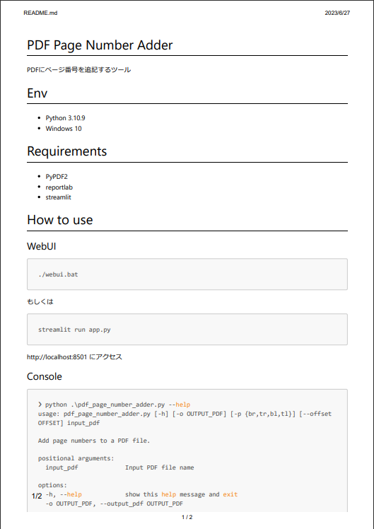
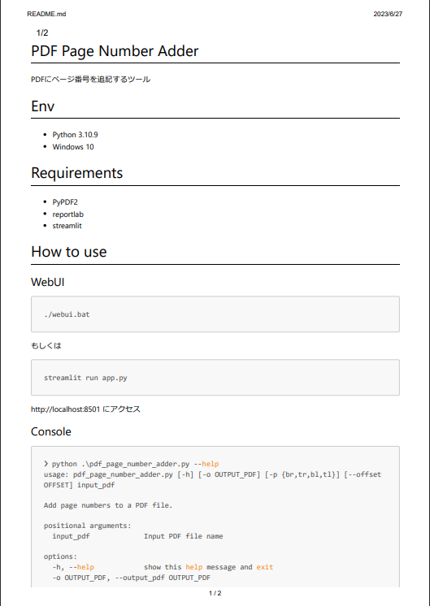
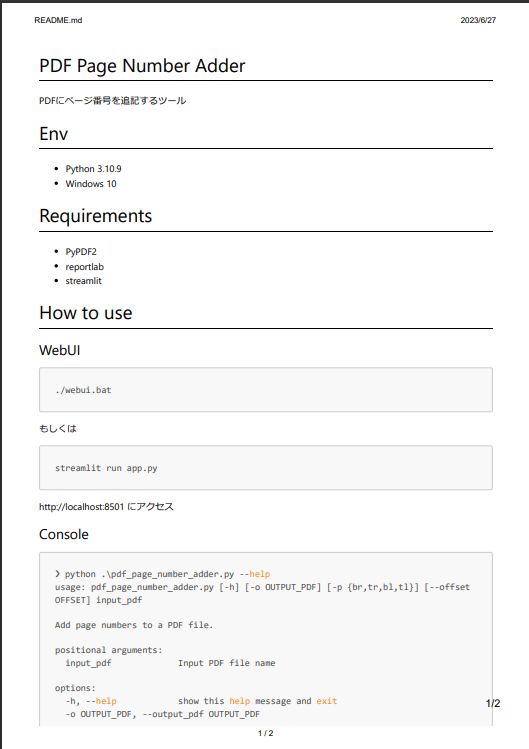
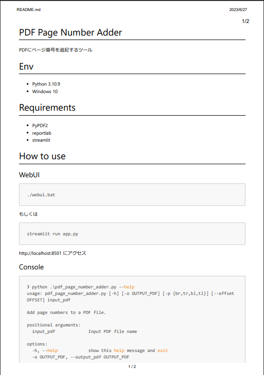
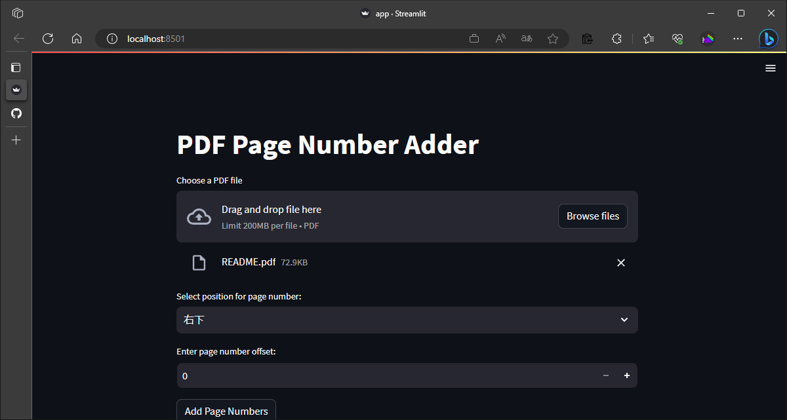
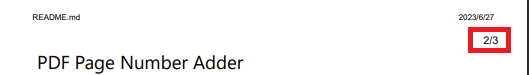

# PDF Page Number Adder

PDFにページ番号を追記するツール

## Preview

| 左下 | 左上 | 右下 | 右上（デフォルト）|
| :--- | :--- | :--- | :--- |
|  |  |  |  |


# Env

- Python 3.10.9
- Windows 10

# Requirements

- PyPDF2
- reportlab
- streamlit

# How to use

## WebUI

```bash
./webui.bat
```

もしくは

```bash
streamlit run app.py
```

http://localhost:8501 にアクセス



## Console

```bash
❯ python .\pdf_page_number_adder.py -h
usage: pdf_page_number_adder.py [-h] [-o OUTPUT_PDF] [-p {br,tr,bl,tl}] [--offset OFFSET] input_pdf

Add page numbers to a PDF file.

positional arguments:
  input_pdf             Input PDF file name

options:
  -h, --help            show this help message and exit
  -o OUTPUT_PDF, --output_pdf OUTPUT_PDF
                        Output PDF file name (optional)
  -p {br,tr,bl,tl}, --position {br,tr,bl,tl}
                        Position of the page numbers (bottom-right, top-right, bottom-left, top-left).
  --offset OFFSET       Offset for the page numbers (optional)
```

# Instruction

## ページ番号オフセット

コンソールからだと`--offset`、WebUIからだと「Enter page number offset:」を指定すると、ページ番号を指定した数値分オフセットできる。


